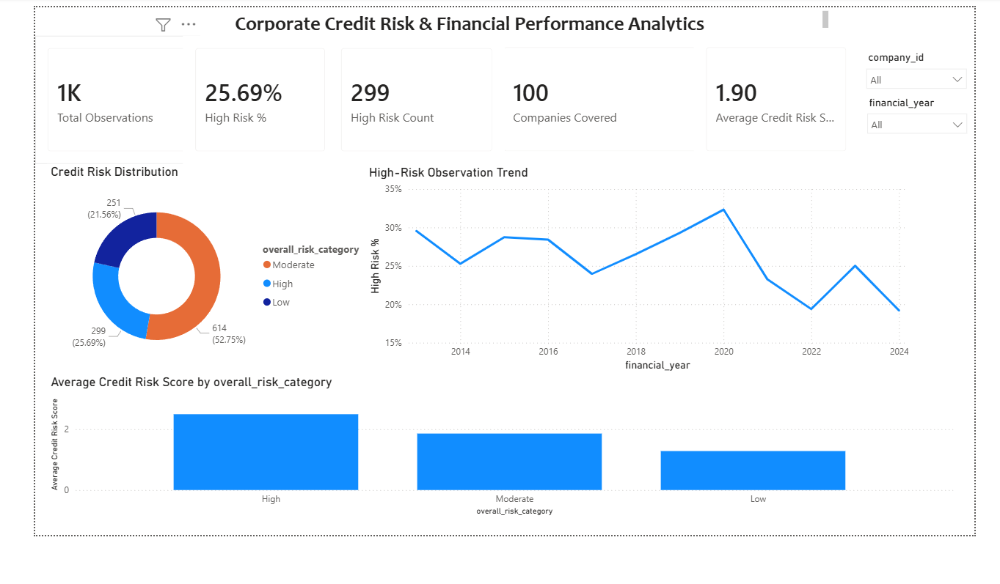
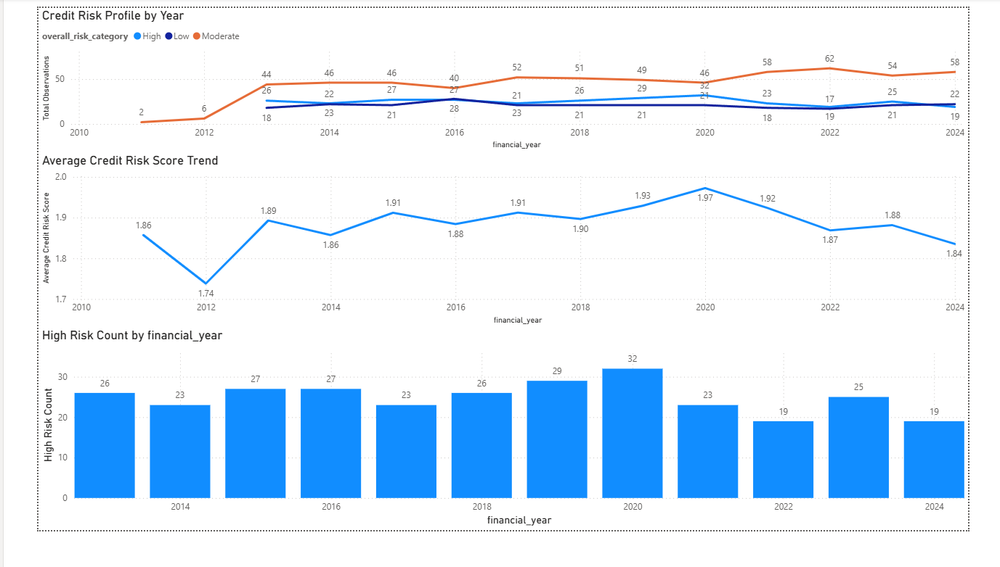
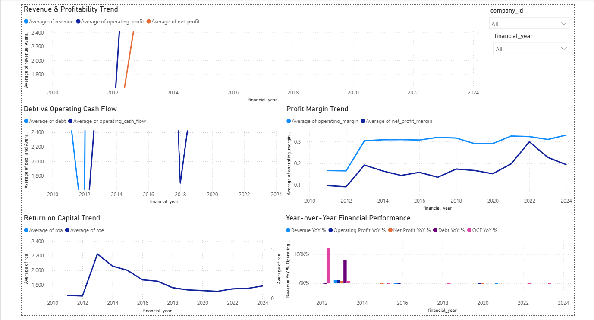
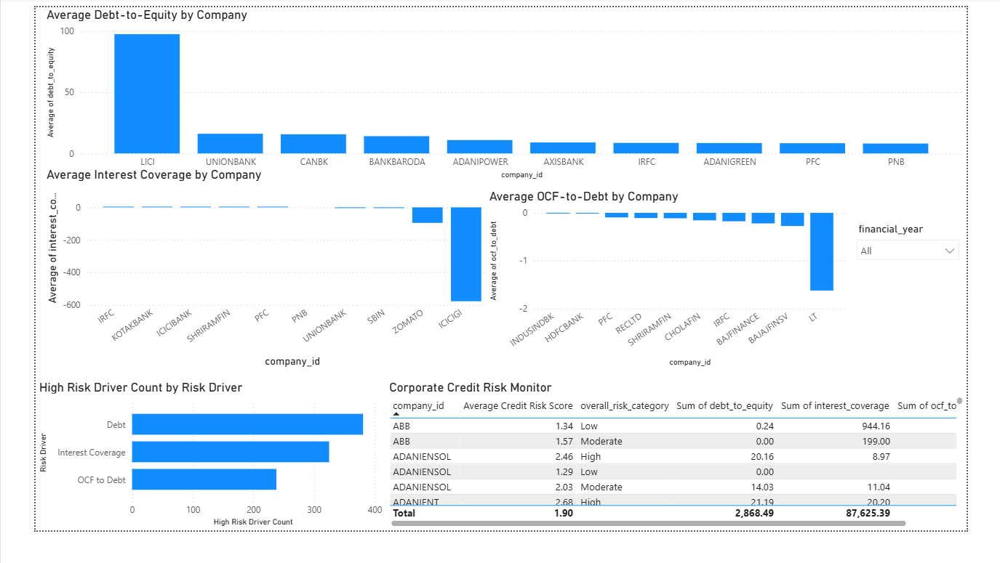

# Corporate Credit Risk & Financial Performance Analytics

**Excel | MySQL | Power BI**

A credit-monitoring framework built on 1,164 company-year observations across 100 companies (2011–2024). It scores each company-year on credit risk and flags leverage pressure, weak debt service, and cash-flow stress.

## Business Problem

Lenders need to know whether borrowers can service their debt. This project turns raw financial statements into a repeatable early-warning process for credit monitoring.

## Results

| Risk Category | Observations | Share |
|---|---|---|
| Moderate | 614 | 52.8% |
| High | 299 | 25.7% |
| Low | 251 | 21.6% |

Roughly one in four company-years is High Risk and warrants closer monitoring. 

## Approach

1. **Excel:** Cleaned and validated data (missing values, duplicates, year errors) and calculated ratios.
2. **Risk scoring:** Combined Debt-to-Equity, Interest Coverage, OCF-to-Debt, Operating Margin, Net Margin, ROA, and ROE into a Low / Moderate / High framework. 
3. **MySQL:** Analyzed risk trends by year, company-level rankings, leverage, interest coverage, cash-flow support for debt, and key risk drivers.
4. **Power BI:** Built a four-page dashboard: Executive Overview, Credit Risk Trend, Financial Performance, and Credit Assessment.
 
## Disclaimer
Created for analytical and portfolio purposes only. It does not represent the methodology, ratings, or lending decisions of any financial institution.

## Power BI Dashboard

### Executive Overview

### Credit Risk Trend

### Financial Performance

### Credit Assessment

